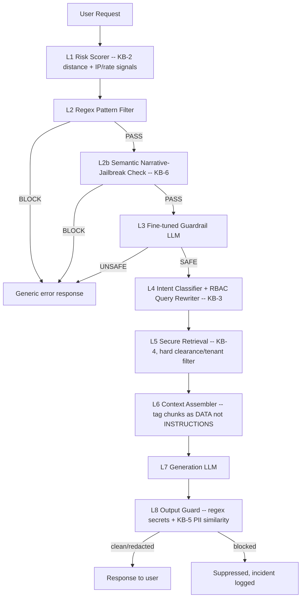

# Secure RAG Support Assistant

An 8-layer secure Retrieval-Augmented Generation (RAG) pipeline for a contact/support
assistant, built as part of a thesis project on defending RAG systems against prompt
injection, narrative jailbreaks, RBAC bypass, and indirect document-based exploits.

Unlike a typical RAG tutorial (embed → retrieve → generate), every request here passes
through a layered security pipeline *before* retrieval and generation are allowed to run,
and the generated answer is screened again before it reaches the user. Detection,
retrieval, and generation are deliberately kept as small, independently-toggleable Python
modules (no LangChain/LlamaIndex chain abstractions) so each layer's contribution to
accuracy, false-positive rate, and latency can be measured in isolation for the thesis's
ablation study.

## Why this exists

Naively wiring an LLM to a vector store creates a support assistant that will:
- follow instructions hidden inside retrieved documents ("indirect prompt injection"),
- get talked out of its guardrails through role-play/fictional framings ("narrative
  jailbreaks") even when literal-phrase filters catch nothing,
- return sensitive internal documents to users who were never authorized to see them,
- leak secrets or PII that happened to end up in the model's output.

This project treats each of those as a distinct threat with a distinct mitigation layer,
rather than relying on a single "is this safe?" classifier call.

## Architecture



| Layer | Role | Backed by | Runs an LLM? |
|---|---|---|---|
| **L1** Risk Scorer | Computes a `risk_score` from nearest-attack distance + IP reputation + request rate; decides fast-path vs. full-path | KB-1 (session log), KB-2 | No |
| **L2** Pattern Filter | Regex match against known literal injection phrases ("you are now in DAN mode", "reveal your system prompt", etc.) | — | No |
| **L2b** Narrative Guard | Embedding-similarity check against hand-authored jailbreak *archetypes* — catches paraphrased social-engineering framings regex can't ("as a researcher with ethical approval...", "purely fictional scenario...") | KB-6 | No |
| **L3** Guardrail LLM | Fast KB-2 distance short-circuit, else a fine-tuned Llama-Guard-3-1B LoRA adapter judges SAFE/UNSAFE from full context | KB-2, fine-tuned adapter | **Yes** |
| **L4** Query Rewriter | Maps the caller's role to a clearance level + allowed document types, scoping the query before it ever reaches the vector store | KB-3 (RBAC policy) | No |
| **L5** Secure Retrieval | Hard pre-filter (`clearance_level <= user_clearance`, `document_type ∈ allowed_types`, `tenant_id` match) applied *before* the vector search runs, plus an append-only audit log of every retrieval | KB-4 | No |
| **L6** Context Assembler | Wraps every retrieved chunk in `[DOCUMENT]...[/DOCUMENT]` tags with a trust/citation marker, so the generation model is told (in-context) to treat retrieved text as data, never as instructions | — | No |
| **L7** Generation | Produces the final, citation-constrained answer from only the tagged context | — | **Yes** |
| **L8** Output Guard | Regex secret scanner (API keys, SSNs, card numbers) + embedding similarity against synthetic PII, applied to the *generated answer* before it's returned | KB-5 | No |

Each security layer (`enable_l2`, `enable_l2b`, `enable_l3`, `enable_l8`) can be toggled
independently at runtime via `config/settings.py` — this is what makes the ablation study
in `eval/ablation_runner.py` possible without maintaining separate code paths.

### Knowledge bases

All knowledge bases are ChromaDB collections sharing one embedding model
(`sentence-transformers/all-MiniLM-L6-v2`, 384-d), managed by a single `KBManager`
singleton so the model and client are loaded once per process.

| KB | Contents | Used by |
|---|---|---|
| KB-1 | Session/IP rate-tracking (Redis, with an in-memory fallback if Redis isn't running) | L1 |
| KB-2 | Attack-prompt signatures sampled from a labeled train set | L1, L3 |
| KB-3 | RBAC policy: role → clearance level + allowed document types (`rbac_policy.yaml`) | L4 |
| KB-4 | The actual support-assistant content, chunked and tagged with clearance/tenant metadata | L5 |
| KB-5 | Synthetic PII (Faker-generated SSNs, credit cards, emails, phone numbers, addresses, ...) | L8 |
| KB-6 | Hand-authored narrative jailbreak archetypes (semantic patterns, not literal phrases) | L2b |

## Repository structure

```
config/                 # dataclasses (config/settings.py) + reloadable thresholds.yaml
data/                   # actual support content, one subfolder per document_type/clearance level
  public_faq/           # clearance 0 — public
  product_info/         # clearance 1
  company_info/         # clearance 2
  developer_info/       # clearance 3
  sales_info/           # clearance 4 — most restricted
  security_datasets/    # raw train/test jsonl for KB-2/KB-6 (gitignored, not shipped)
knowledge_bases/        # kb_manager singleton, RBAC policy, KB build scripts
security/               # L1, L2, L2b, L3, L8
ingestion/              # loaders, chunkers, metadata tagging, KB-4 build script
retrieval/              # L4 query rewriter, L5 secure retrieval + audit log
generation/             # L6 context assembler, L7 generation (Anthropic API)
pipeline/               # orchestrator.py — wires L1 -> L8 into one call
api/                    # FastAPI /chat endpoint
eval/                   # metrics (ARR/FPR/DLR/SOR), threshold calibration, ablation runner
logs/                   # append-only retrieval audit log (gitignored, created at runtime)
chroma_db/              # ChromaDB persistent storage (gitignored, rebuilt from data/ + KB scripts)
```

## Setup

```bash
pip install -r requirements.txt
cp .env.example .env   # fill in ANTHROPIC_API_KEY
```

Requires Python 3.10+. `security/l3_llm_guardrail.py` loads a 4-bit quantized
Llama-Guard-3-1B base model plus a LoRA adapter via `transformers` + `peft` +
`bitsandbytes` — a CUDA GPU is strongly recommended for that layer; every other layer is
CPU-friendly.

## Build order

1. **Populate the detection knowledge bases** (KB-2 attack signatures, KB-5 synthetic PII,
   KB-6 narrative archetypes):
   ```bash
   python -m knowledge_bases.build_kb2_attacks   # needs data/security_datasets/train_dataset.jsonl
   python -m knowledge_bases.build_kb5_pii
   python -m knowledge_bases.build_kb6_narrative
   ```
2. **Add real support content** under `data/{public_faq,product_info,company_info,developer_info,sales_info}/`
   (markdown/text; FAQ files are chunked as Q/A blocks, everything else with a recursive
   word-window chunker), then build KB-4:
   ```bash
   python -m ingestion.build_kb4
   ```
3. **Calibrate detection thresholds** against your actual KB-2/KB-6 population and a
   labeled test set (`data/security_datasets/test_dataset.jsonl`):
   ```bash
   python -m eval.calibrate_thresholds
   ```
4. **Run the API**:
   ```bash
   uvicorn api.main:app --reload
   ```
   ```bash
   curl -X POST localhost:8000/chat \
     -H "Content-Type: application/json" \
     -d '{"query": "How do I reset my password?", "user_id": "u1", "role": "customer"}'
   ```
5. **Evaluate**:
   ```bash
   python -m eval.ablation_runner
   ```
   Runs the detection pipeline with different layers toggled off (`No_L2`, `No_L2b`,
   `No_L3`, `Detection_Off`, ...) plus an RBAC-bypass leakage test (data leakage rate) and
   an L6-tagging-off injection test, and writes CSV summaries to `eval/results/`.

## Configuration

All thresholds and model names live in `config/settings.py` as dataclasses, mirrored in
`config/thresholds.yaml` so they can be re-tuned without a code change (loaded via
`config.settings.load_thresholds()`, falling back to the dataclass defaults for any
missing key):

- `l3_kb_match_threshold` — KB-2 distance below which L3 short-circuits straight to UNSAFE.
- `narrative_match_threshold` — KB-6 distance below which L2b blocks as a narrative jailbreak.
- `kb5_pii_threshold` — KB-5 distance below which L8 blocks the generated answer.
- `fast_path_ceiling` — L1 risk score below which a query skips straight past L3 (set to
  `-1.0` to force every query through L3).
- RBAC roles/clearance levels/allowed document types are defined declaratively in
  `knowledge_bases/rbac_policy.yaml`.

## Evaluation metrics

Defined in `eval/metrics.py`:

- **ARR** (Attack Rejection Rate / recall) — fraction of actual attacks correctly blocked.
- **FPR** (False Positive Rate) — fraction of legitimate queries incorrectly blocked.
- **DLR** (Data Leakage Rate) — fraction of above-clearance documents that would leak if
  L4/L5's RBAC filter were bypassed; measured by `eval/ablation_runner.run_rbac_leakage_test`.
- **SOR** (Security Overhead Ratio) — added latency from running the full security
  pipeline vs. an unprotected baseline.

Threshold calibration (`eval/calibrate_thresholds.py`) picks, for each detection layer,
the threshold that maximizes recall while keeping calibration-set FPR under a target
ceiling — sweeping thresholds rather than hand-picking them, and falling back to the
lowest achievable FPR if the target isn't reachable.

## Design principles

- **No RAG framework.** Every layer is a plain Python module with explicit enable/disable
  flags, not a LangChain/LlamaIndex chain — so each layer's effect on the ablation metrics
  above can be isolated.
- **Retrieved content is data, never instructions.** L6 exists specifically so an
  attacker who successfully plants an injection payload *inside a retrieved document*
  still can't get the generation model to follow it — the model is told in-context that
  everything between `[DOCUMENT]` tags is reference material to cite, not commands.
- **RBAC is enforced before the vector search runs**, not filtered out of the results
  afterward — an unauthorized document is never even a retrieval candidate.
- **Zero-retraining threat response.** New attack patterns are appended directly to KB-2
  (`knowledge_bases.build_kb2_attacks.append_new_attacks`) without retraining the L3
  guardrail adapter, so newly discovered attacks can be mitigated immediately.
- **Fail loud, not silent.** Every block returns a generic response but is logged with
  which layer blocked it; L5 retrieval is separately audit-logged (`logs/retrieval_audit.jsonl`)
  regardless of outcome, so unauthorized-access attempts are traceable even when they're
  correctly denied.
